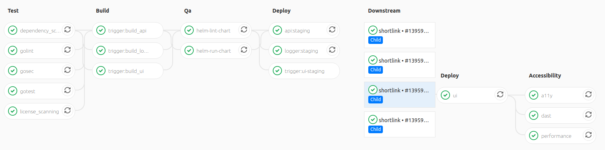

# GitLab CI

---

### Generic pipeline stages

| Stage   | Description                                                                                     |
|---------|-------------------------------------------------------------------------------------------------|
| .pre    | `.pre` is guaranteed to always be the first stage in a pipeline                                 |
| test    | Perform code anaysis jobs (code quality, Static Application Security Testing, dependency check) |
| build   | Build (when applicable), unit test (with code coverage), and package the code                   |
| deploy  | Deploy the application to a environment                                                         |
| qa      | Perform acceptance tests on the upstream environment                                            |
| release | Artifacts of builds. Publish a notification                                                     |
| .post   | `.post` is guaranteed to always be the last stage in a pipeline.                                |

---

### Structure directories

[//]: # (tree -C --sort  mtime)
```
.
├── pipelines                     // GitLab CI pipelines
│   ├── flutter.yml
│   ├── release_ml.yml
│   ├── ui.yml
│   ├── helm_additional.yml
│   ├── terraform.yml
│   ├── helm_deploy.yml
│   ├── addons                     // GitLab CI pipelines for addons
│   │   ├── network.yml
│   │   ├── monitoring.yml
│   │   ├── k8s.yml
│   │   ├── database.yml
│   │   ├── mq.yml
│   │   └── deploy.yml
│   ├── test                       // GitLab CI pipelines for test
│   │   ├── helm.yml
│   │   ├── dependency.yml
│   │   ├── sast.yml
│   │   └── golang.yml
│   └── build                      // GitLab CI pipelines for build
│       ├── helm_chart.yml
│       └── docker_base.yml
├── workflows                      // GitLab CI workflows
│   ├── matrix_build_helm.yml
│   ├── matrix_build_base.yml
│   ├── matrix_deploy.yml
│   └── matrix_build_ui.yml
├── templates                      // GitLab CI templates
│   ├── go.yml
│   ├── helm.yml
│   ├── common.yml
│   └── build.yml
├── stages                         // GitLab CI stages
│   ├── qa.yml
│   ├── release.yml
│   ├── accessibility.yml
│   ├── test.yml
│   ├── deploy.yml
│   └── build.yml
└── README.md
```

---

### Pipeline




---

### Variable

| Name         | Description                          |
|--------------|--------------------------------------|
| GITLAB_TOKEN | Used for `RENOVATE_TOKEN` and etc... |

---

##### Support environment

- Minikube
- [Yandex Cloud](https://cloud.yandex.ru/)
- [AWS EKS](https://aws.amazon.com/eks/)
