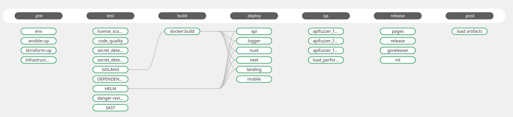

# GitLab CI

---

### Generic pipeline stages

| Stage | Description |
| --- | --- |
| .pre | `.pre` is guaranteed to always be the first stage in a pipeline |
| test | Perform code anaysis jobs (code quality, Static Application Security Testing, dependency check) |
| build | Build (when applicable), unit test (with code coverage), and package the code |
| deploy | Deploy the application to a environment |
| qa | Perform acceptance tests on the upstream environment |
| release | Artifacts of builds. Publish a notification |
| .post | `.post` is guaranteed to always be the last stage in a pipeline. |

---

### Structure directories

```md
├── jobs                                       // Single task
│         ├── accessibility.yml
│         ├── ansible.yml
│         ├── build.yml
│         ├── deploy.yml
│         ├── qa.yml
│         ├── release.yml
│         ├── schedule.yaml
│         └── test.yml
├── pipelines                                  // Pipelines jobs
│         ├── addons
│         │         ├── auth.yml
│         │         ├── database.yml
│         │         ├── network.yml
│         │         ├── k8s.yml
│         │         ├── monitoring.yml
│         │         └── mq.yml
│         ├── build
│         │         ├── docker_go.yml
│         │         ├── docker_nodejs.yml
│         │         └── helm_chart.yml
│         ├── flutter.yml
│         ├── helm_additional.yml
│         ├── helm_deploy.yml
│         ├── release_ml.yml
│         ├── terraform.yml
│         ├── test
│         │         ├── dependency.yml
│         │         ├── golang.yml
│         │         ├── helm.yml
│         │         └── sast.yml
│         └── ui.yml
├── templates                                  // Template for jobs
│         ├── build.yml
│         ├── common.yml
│         ├── deploy.yml
│         ├── go.yml
│         ├── helm.yml
│         └── rules.yml
└── workflows                                  // Matrix for pipelines
    ├── matrix_build_base.yml
    ├── matrix_build_helm.yml
    ├── matrix_build_nodejs.yml
    └── matrix_deploy.yml
```

---

### Pipeline




---

### Variable

| Name | Description |
| --- | --- |
| SURGE_LOGIN | |
| SURGE_TOKEN | |
| DANGER_GITLAB_API_TOKEN | `API TOKEN` for danger |

---

##### Support environment

- Minikube
- [Yandex Cloud](https://cloud.yandex.ru/)
- [AWS EKS](https://aws.amazon.com/eks/)
