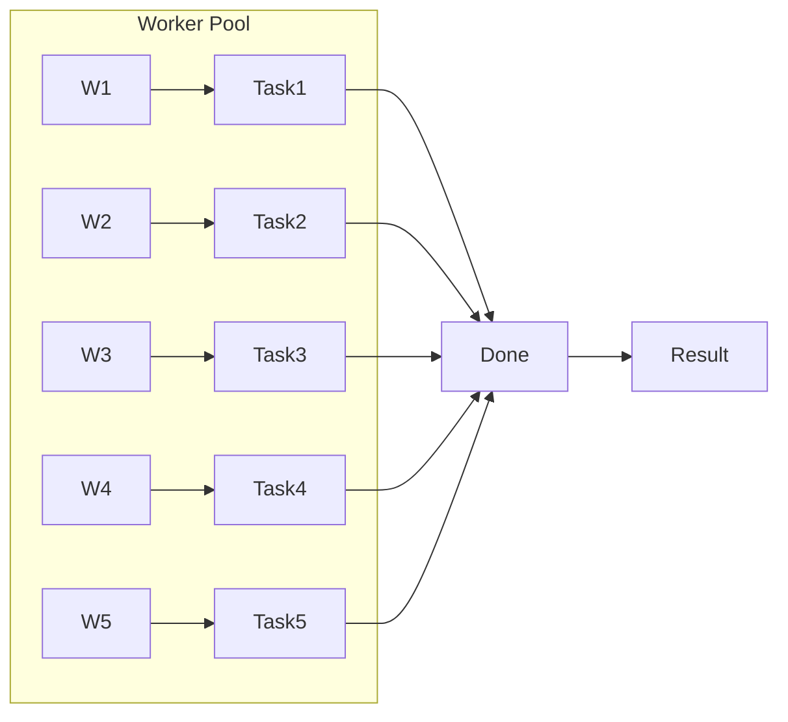

## Worker pool

#### TODO:

- [ ] Use `sync.Pool` or `sync.Cond` to manage workers
- [ ] Add Graceful Shutdown

#### References

**Looking for Alternatives? Peek Here:**

- https://github.com/panjf2000/ants
