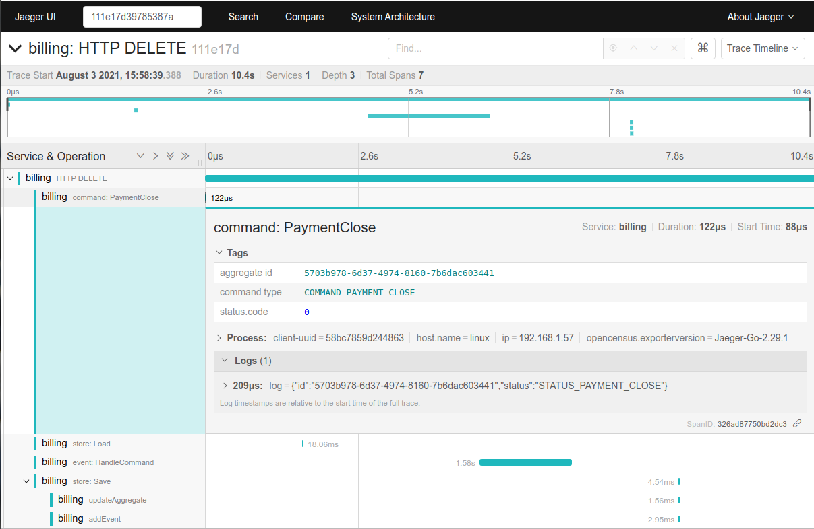

### event-sourcing

This is a simple event sourcing library for Go.

### Feature

- EventBus
- Snapshots
- OpenTracing
- Store engine
  - PostgreSQL

##### OpenTracing

##### References

+ [Go - CQRS / Event Sourcing made easy - Go](https://github.com/mishudark/eventhus)
+ [Examples and Tutorials of Event Sourcing in .NET](https://github.com/oskardudycz/EventSourcing.NetCore)
