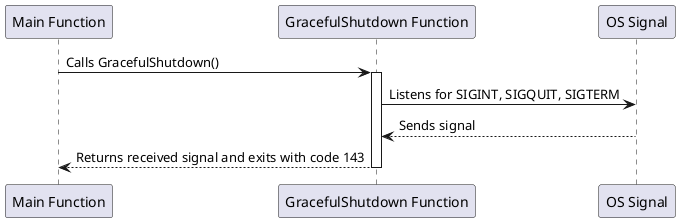

## Graceful Shutdown

This package provides a simple way to handle graceful shutdown signals in Go applications. 

### Best Practices

#### 143: Exit Code

The exit code `143` is used to indicate that the process was terminated by a signal. 
This is a common practice and is used by many applications.

### References

- [Tutorial: Graceful Shutdown](https://thegodev.com/graceful-shutdown/)
