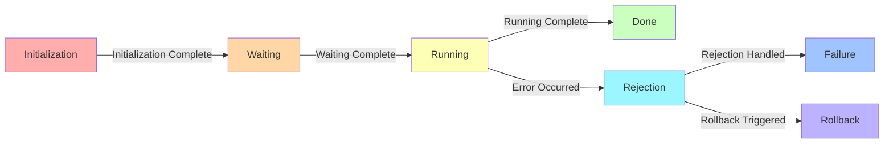

### Saga manager

In distributed systems, it can be difficult to ensure that a complex 
operation is completed successfully without encountering errors or failures. 
A saga is a way of managing these types of operations by breaking them down into smaller, 
independent steps that can be executed and managed separately.

#### Saga steps of state:

+ INIT -> WAIT -> RUN -> DONE/REJECT
+ REJECT -> FAIL/ROLLBACK



#### Example

```go
package main

import (
	"context"
	
  "github.com/shortlink-org/go-sdk/saga"
)

func (l *linkUseCase) addLinkSaga(ctx, link link.Link) error {
	const SAGA_NAME = "Add link"
	const SAGA_STEP_SAVE_LINK = "Save link in store"
	const SAGA_STEP_GET_METADATA = "Get metadata by link"

  // create a new saga for add link
  sagaAddLink, errs := saga.
    New(SAGA_NAME).   // name saga
    WithContext(ctx). // ctx for tracing
    Build()
  
  if len(errs) > 0 {
    // check err...
  }
  
  // step: save to store
  _, err = saga.AddStep(SAGA_STEP_SAVE_LINK).
    Then(func(context.Context) error {
      err := l.Store.Add(link)
      return err
    }).
    Reject(func(context.Context, thenErr error) error {
      err := l.Store.Delete(link)
      return err
    }).
    Build()
  
  if len(errs) > 0 {
    // check err...
  }

  // step: get metadata
  saga.AddStep(SAGA_STEP_GET_METADATA).
    Then(addFunc).
    Reject(cancelAddFunc)

  // step: send notify
  saga.AddStep("send notify").
    Needs(SAGA_STEP_SAVE_LINK, SAGA_STEP_GET_METADATA).
    Then(youNotifyFunc)
  
  // Run saga
  err := sagaAddLink.Play(nil)
  return err
}
```

### Options

- **SetLogger** - add logger for saga
- **SetLimiter** - set limiter for goroutines (default unlimited)

### OpenTracing


### References

> [!NOTE]
> **Alternatives**:
> [cff](https://uber-go.github.io/cff/) - Concurrency toolkit for Go (_uber_)

- [Pattern: Saga](https://microservices.io/patterns/data/saga.html)
- [DAG](https://github.com/goombaio/dag) - for build pipeline steps
- libs:
  - [go-saga](https://github.com/itimofeev/go-saga) - example go-library
  - [goflow](https://github.com/s8sg/goflow)
  - https://github.com/danielgerlag/workflow-core
  - https://github.com/VladKopanev/cats-saga
