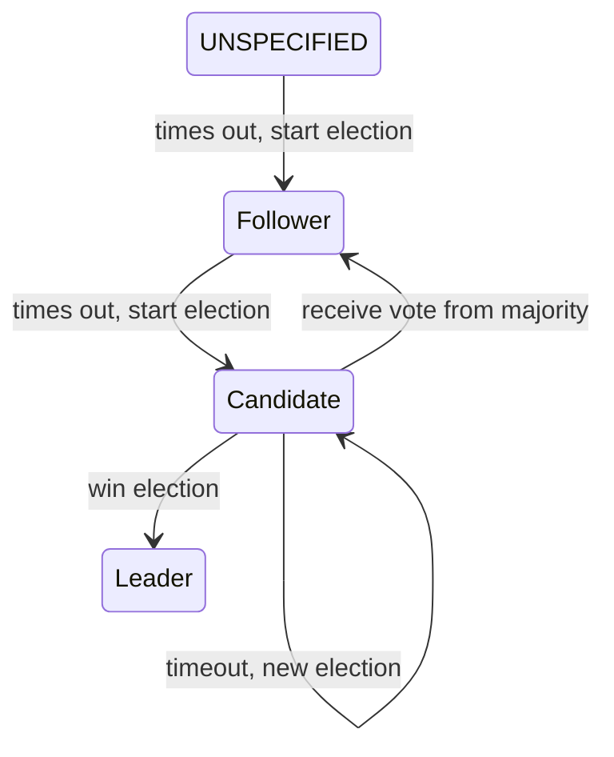

## Raft

### Getting Started

```go
package main

import (
	"github.com/shortlink-org/shortlink/pkg/raft"
)

func main() {
	r, err := raft.New(raft.Config{
		Name:     "node1",
		BindAddr: "localhost:8001",
	})
	if err != nil {
		panic(err)
	}

	r.Go(func() {
		// Do something
	})
}
```

### Raft server states



#### Docs

+ [The Raft Consensus Algorithm](https://raft.github.io/)
+ [Implementing Raft](https://eli.thegreenplace.net/2020/implementing-raft-part-0-introduction/)
