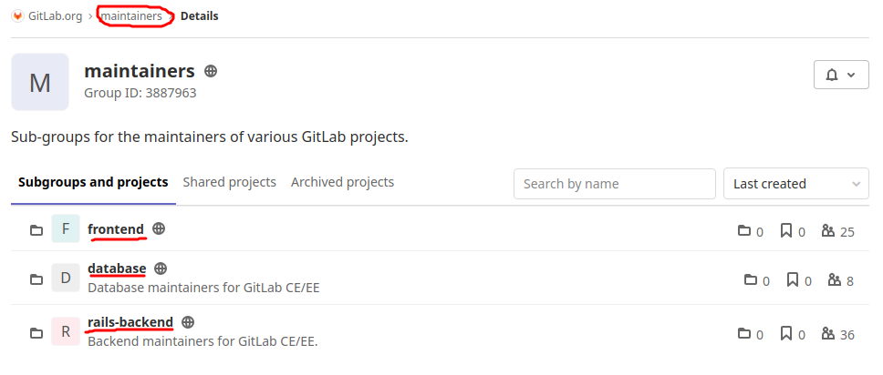

# CODEOWNER

File for description of command responsibility areas

### Example from GitLab



### Structure

```
- groupCompany
  - project-workspace-1
    - project-1
    - project-2
    - project-3
  - project-workspace-N
    - project-1
    - project-N
  - maintainers
    - frontend
    - backend
    - database
    - etc...
```

### Link

- [GitLab](https://docs.gitlab.com/ee/user/project/code_owners.html)
- [GitLab CODEOWNERS config](https://gitlab.com/gitlab-org/gitlab/-/blob/master/.gitlab/CODEOWNERS)
