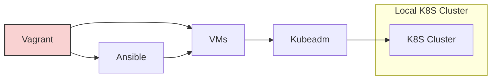

### Vagrant && K8S

This POC is about how to use Vagrant for local K8S cluster.

1. We use kubeadm for installation K8S cluster.
2. We use Vagrant for running VMs.
3. We use Ansible for provisioning VMs.

