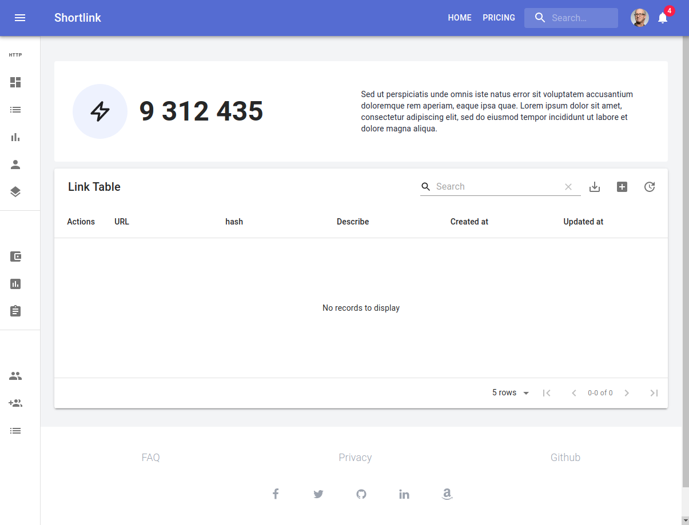

## NEXT-UI Application

This UI for shortlink application

#### Feature/Require

- NextJS (SSR/Static generate content)
- Auth (Kratos)
- Monitoring (Sentry)
- Pretty UI
  - TailwindCSS
  - Material-UI
- Pretty code base
  - Typescript
  - ESLint/Prettier
- Storybook (for UI)
- Cypress (for E2E)

### Getting start

```bash
npm ci
npm start

// Ready on http://127.0.0.1:3000/next/auth/login
```

### ENV

Use `.env` file in `ui/next` directories for setting your UI

| Name                           | Value                   | Description                             |
| ------------------------------ | ----------------------- | --------------------------------------- |
| `NODE_ENV`                     |                         | Select: production, development, etc... |
| **ShortLink API**              |                         |                                         |
| `API_URI`                      | `http://localhost:7070` | API port                                |
| `PROXY_URI`                    | `http://localhost:3030` | Proxy service address                   |
| **Sentry**                     |                         |                                         |
| `SENTRY_ENABLE`                | `false`                 | Init Sentry                             |
| `SENTRY_DSN`                   |                         | Your sentry DSN                         |
| **Firebase**                   |                         |                                         |
| `FIREBASE_VAPID_KEY`           |                         | Your firebase VAPID key                 |
| `FIREBASE_API_KEY`             |                         | Your firebase API key                   |
| `FIREBASE_AUTH_DOMAIN`         |                         | Your firebase auth domain               |
| `FIREBASE_PROJECT_ID`          |                         | Your firebase project id                |
| `FIREBASE_STORAGE_BUCKET`      |                         | Your firebase storage bucket            |
| `FIREBASE_MESSAGING_SENDER_ID` |                         | Your firebase messaging sender id       |
| `FIREBASE_APP_ID`              |                         | Your firebase app id                    |
| `FIREBASE_MEASUREMENT_ID`      |                         | Your firebase measurement id            |

### Build docker image

```bash
docker buildx build -t next-ui -f ops/dockerfile/ui-next.Dockerfile .
```

### UI Screenshot

<details>

| Describe   | Screenshot                         |
| ---------- | ---------------------------------- |
| Link Table |  |

</details>

## Storybook

```bash
npm run storybook
```
